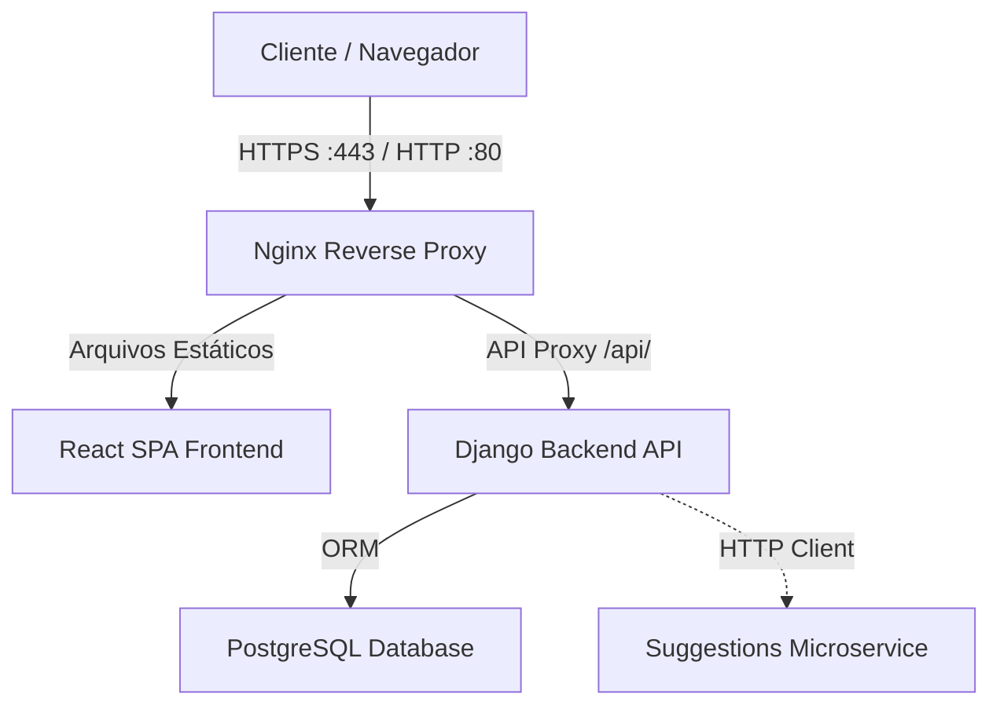

# 📋 Projeto Orizon — Gerenciador de Tarefas Inteligente

[](https://github.com/techcarlosandre/Orizon/actions/workflows/backend-ci.yml)
[](https://github.com/techcarlosandre/Orizon/actions/workflows/frontend-ci.yml)

> Uma aplicação web de gerenciamento de tarefas profissional e de alto desempenho. Construída sob as melhores práticas de **Clean Code**, **Testes Automatizados (unitários, de integração e fim a fim)** e infraestrutura robusta na **AWS** com **SSL/HTTPS**.

---

## 🔗 Links do Projeto
* **Deploy Ativo (AWS):** [https://orizon.techcarlos.com.br](https://orizon.techcarlos.com.br)
* **Desenvolvedor:** [Carlos Silva (Portfólio)](https://portfolio.techcarlos.com.br/)

---

## 🏗️ Visão Geral da Arquitetura

O **Projeto Orizon** adota uma separação clara de responsabilidades (Decoupled Architecture) utilizando Django REST Framework no backend e React no frontend, orquestrados via containers Docker.



### 🛠️ Tecnologias Utilizadas
* **Backend:** Python 3.12, Django 5.0, Django REST Framework, JWT (SimpleJWT), Gunicorn.
* **Frontend:** React 18, Vite 5, Axios (com interceptores de refresh token automático), Vanilla CSS.
* **Banco de Dados:** PostgreSQL 16 (Alpine).
* **Infraestrutura & DevOps:** AWS EC2, Docker & Docker Compose, Nginx, Let's Encrypt (Certbot), GitHub Actions.
* **Qualidade & Testes:** pytest (testes unitários e de integração), Selenium Webdriver (testes E2E com Chrome Headless).

---

## ⚡ Principais Funcionalidades

1. **Autenticação JWT Segura:** Login, registro e renovação transparente de sessão utilizando *Refresh Tokens* com sistema de blacklist.
2. **Gerenciamento de Tarefas completo (CRUD):** Criação, edição, listagem com paginação e exclusão de tarefas personalizadas.
3. **Categorias Inteligentes:** Organização de tarefas com sugestões automáticas baseadas em termos (ex: "estudar" sugere a categoria "Estudos").
4. **Compartilhamento Granular (TaskShare):** Compartilhe tarefas específicas com outros usuários da plataforma definindo níveis de permissão exclusivos (`view` ou `edit`).

---

## 🔬 Qualidade de Código & Cobertura de Testes

A qualidade do projeto é garantida por uma robusta suíte de testes automatizados, integrados em um pipeline de Integração Contínua (CI) no GitHub Actions.

### Testes Automatizados no Backend (pytest)
Os testes unitários e de integração validam as regras de negócio das entidades de tarefas, as validações de restrições de categorias, o fluxo de envio de e-mails transacionais e a lógica de permissões de compartilhamento.

### Testes Fim a Fim (E2E) com Selenium
Os testes simulam a jornada real do usuário (Registro -> Login -> Criar Categoria -> Criar Tarefa -> Concluir -> Logout) e rodam de forma automatizada em modo headless (sem interface gráfica), tanto localmente quanto no ambiente de CI do GitHub Actions.

---

## 📋 Como Executar o Projeto Localmente

### Pré-requisitos
* Docker e Docker Compose instalados.

### 1. Clonar o Repositório e Configurar Env
```bash
git clone https://github.com/techcarlosandre/Orizon.git
cd Orizon
cp .env.example .env
```

### 2. Iniciar a Aplicação com Docker Compose (Desenvolvimento)
```bash
docker compose up --build
```
* **Frontend:** `http://localhost:5173`
* **API Backend:** `http://localhost:8000/api/`

### 3. Executar a Suíte de Testes
```bash
# Rodar testes unitários e de integração (Django + pytest)
docker compose exec backend pytest -v

# Rodar testes E2E (Selenium)
cd selenium_tests
pip install -r requirements.txt
pytest test_e2e.py -v
```

---

## 🧠 Decisões de Design (Clean Code)
* **ViewSets & Routers (DRF):** DRY (*Don't Repeat Yourself*) levado ao máximo na estruturação das APIs.
* **Segurança declarativa de permissões:** Criação de mapeamentos específicos para as permissões customizadas de compartilhamento.
* **Isolamento de Domínio:** A lógica de sugestão de categorias está isolada na pasta `suggestions/` e é consumida via cliente HTTP encapsulado (`httpx`), permitindo sua fácil migração para microsserviços futuros.
* **Flat Config (ESLint):** Configuração moderna de linting no frontend para garantir conformidade estrita de estilo de código.
